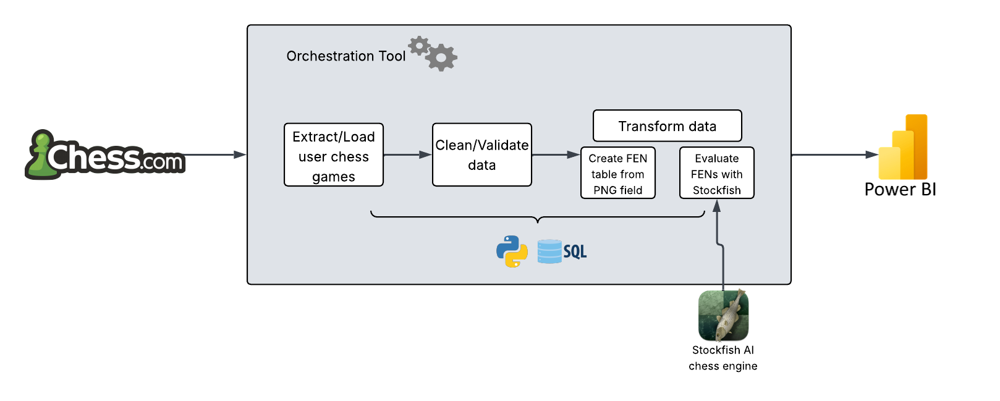

# Malicious URL Processing ELT Pipeline

## Overview

This project focuses on building an **ELT (Extract, Load, Transform) pipeline** to evaluate my chess matches. The pipeline consists of three main stages:

- **Extract**: Ingests the chess matches from Chess.com API into the system.  
- **Load**: Stores the raw data in a structured database while maintaining data integrity.
- **Transform**: Applies various transformations, including extracting FENs from PGN data, evaluating chess moves with an AI chess engine, and calculating new fields to further understand the data.

## Architecture Diagram

## Transformations
- Edit end_time format
- Extract username from black and white fields
- Create FEN table that contains each move made in the PGN field for each match.
- Calculate overall score for each match
- Create field that classifies each move as a blunder or good move

## Power BI Dashboard
